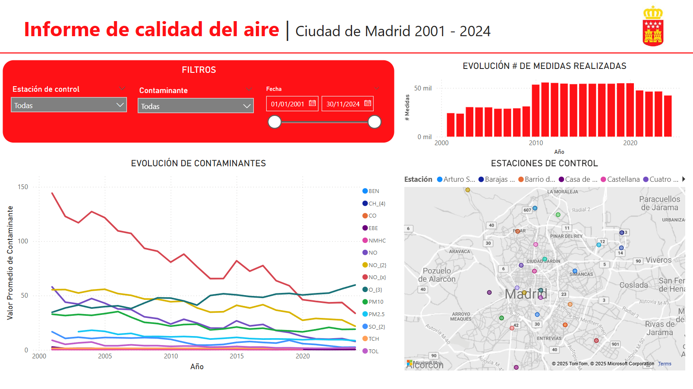
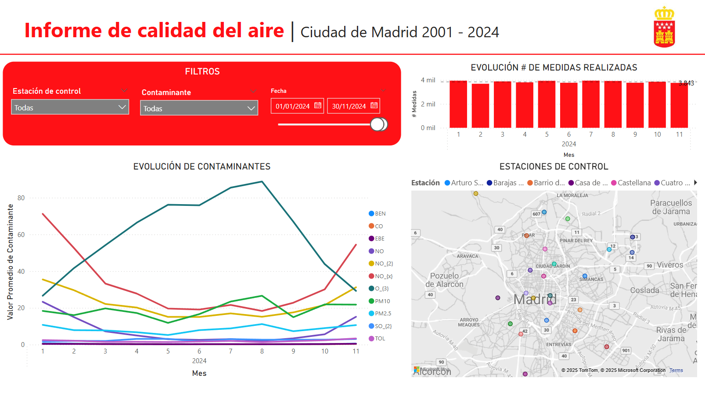

# Proyecto Académico de Business Intelligence - Máster en Ciencia de Datos

<div align="center">
  
</div>

Este repositorio contiene varios archivos referentes a un Sistema de Inteligencia de Negocio para análisis de la calidad del aire en la Comunidad de Madrid, creados como parte del **Máster en Ciencia de Datos** de la **Universidad Camilo José Cela**. Este proyecto académico ha sido diseñado para poner en práctica los conocimientos adquiridos en el ámbito del Business Intelligence a lo largo del máster.

---

## Estructura del Proyecto

### 1. Documentacion.pdf
Memoria descriptiva del proyecto donde se redactan los pasos seguidos para la creación del Sistema de Inteligencia de Negocio que analiza la calidad del aire en la Comunidad de Madrid.  
El Sistema de Inteligencia de Negocio se ha creado con la herramienta Power BI.

### 2. Dashboard_calidad_aire_madrid.pbix
Dashboard elaborado con Power BI para el análisis de la calidad del aire en la Comunidad de Madrid. 

<div align="center">
  
</div>

El archivo contiene la fase de ETL, almacenamiento de datos y visualización a través del propio Dashboard.

### 3. Analisis_calidad_aire_madrid_2024.pdf
Presentación referente al análisis de la calidad del aire en la Comunidad de Madrid para el año 2024. 

<div align="center">
  
</div>

Todos los datos y visualizaciones de la presentación, han sido extraídas del Sistema de Inteligencia de Negocio creado en este proyecto.

---

## Universidad

Este trabajo ha sido desarrollado como parte del programa académico del:

**Máster en Ciencia de Datos**  
[Universidad Camilo José Cela](https://www.ucjc.edu/)

---

## Licencia

> Este repositorio forma parte del portafolio académico personal. Todos los derechos pertenecen al autor y a la Universidad Camilo José Cela.  
> Uso exclusivo para fines educativos.  
> Este proyecto está licenciado bajo [CC BY-NC 4.0](https://creativecommons.org/licenses/by-nc/4.0/). Se requiere atribución al autor.  

---

## Cómo clonar el repositorio en local

```bash
git clone https://github.com/afersantos/business-intelligence-powerbi-calidad-aire-madrid.git
cd business-intelligence-powerbi-calidad-aire-madrid
